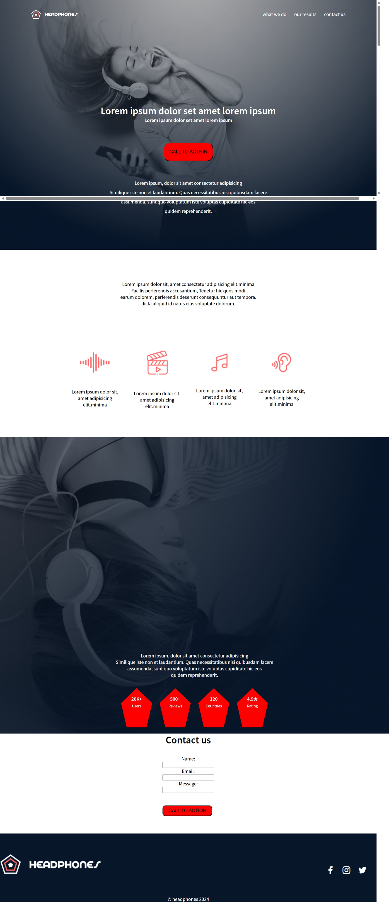

# 🌐 ALX HTML & CSS Practice Projects

This repository contains my practice projects while learning core front‑end fundamentals: HTML, CSS, web layout, responsiveness, and design practices.  
Each folder is a separate mini-project built from scratch — a place to test layouts, styles, and responsive design before moving on to more advanced frameworks.

---

## 📖 About

During my studies in the ALX program, this repository served as my sandbox for mastering:

* Semantic HTML5 markup  
* CSS styling (layouts, flexbox, grids, responsiveness)  
* Mobile-first and responsive design  
* Good project structure for static sites  
* Building simple static pages / landing pages / UI components without JavaScript dependencies  

Projects include basic layout practice, CSS fundamentals, webpage layout recreations, and more.

---

## 📂 Projects Overview

| Folder | Description / What It Demonstrates |
|--------|------------------------------------|
| **headphones** | A static landing page layout (headphone‑themed) — HTML + CSS, styling & responsive layout practice. |
| **css_basic** | Basic CSS exercises: styling typography, colors, spacing, simple layouts. |
| **css_advanced** | More complex CSS tasks: flexbox/grid layouts, responsive components, advanced styling challenges. |


## 🚀 How to View / Run Projects Locally

Since these are static HTML/CSS projects, you don’t need any build tools or npm:  

1. Clone the repo:  
   ```bash
   git clone https://github.com/amanuel1221/alx_html_css.git
Open any folder (e.g. headphones) and double‑click the index.html (or appropriate HTML file) in your browser — it will render locally.

Alternatively, you can host them on a static hosting service (e.g. GitHub Pages, Netlify) for a live preview.

📸 Preview / Screenshots
Add screenshots or GIFs here to showcase the UI for your static pages.

Example:

markdown
Copy code
  
This gives visitors an immediate visual insight into what your HTML/CSS work looks like without opening the files.

🔮 Why This Repository Matters
Even though these are static HTML/CSS projects, they are an important foundation for any web developer:

Demonstrates that you understand HTML semantics, CSS layout, and responsiveness — a baseline skill for frontend roles.

Shows that you can build pages without frameworks, relying on fundamentals.

Provides a clean, lightweight portfolio of static websites — simple but effective.

Empowers you to take on future projects (React, JS, full‑stack) with a strong base in web fundamentals.

This repository is a good “proof of concept” of your front‑end basics for any recruiter or collaborator reviewing your work.

📌 What You Can Do Next / Improvements
Add screenshots or GIFs for each project.

Optionally, deploy static pages using GitHub Pages or Netlify to get live demo URLs. 
GitHub
+1

Add a short description or README inside each subproject folder, explaining what you learned or practiced.

Ensure consistent folder structure and naming across all projects.

Add a “Project date” or “Last updated” field for clarity when revisiting older projects. 
Hatica

📄 License / Use
You are free to use, modify or learn from the code in this repo. This is part of my learning journey — feel free to adapt it for your own studies or projects.
